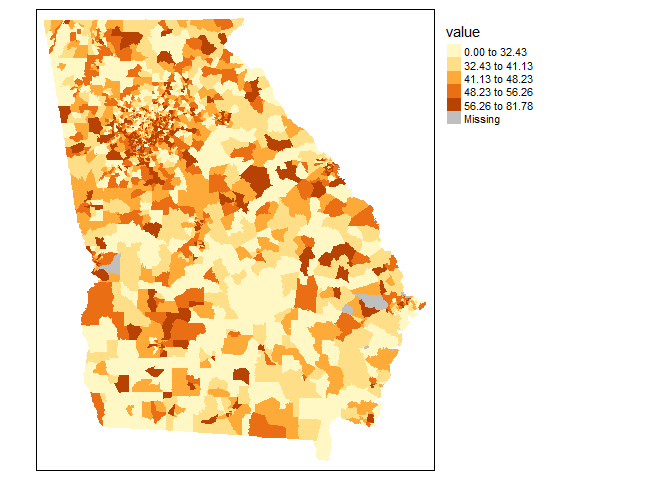

Working with multiple census variables using tidycensus
================
Jerry Shannon
January 29, 2018

Introduction
------------

For the last several years, I've been doing work with the [Athens Wellbeing Project](http://www.athenswellbeingproject.org) (AWP) to collect a public database of variables about the living conditions in Athens-Clarke County, Georgia. This database includes both secondary and primary data, including a systematic survey of over 1,300 residents in fall 2016. My students have helped with the secondary data collection, which has primarily been data from the U.S. Census [American Community Survey](https://www.census.gov/programs-surveys/acs), though it includes variables from the county government and some other online sources. Our existing dataset is available in [this Github repo](https://github.com/jshannon75/awp).

The census data is now two years old, and so I wanted to develop a system for updating it. In the past, I've downloaded data from [Factfinder](https://factfinder.census.gov/faces/nav/jsf/pages/index.xhtml) or [NHGIS](https://www.nhgis.org/) and then stitched spreadsheets together using R. The [acs](https://cran.r-project.org/web/packages/acs/acs.pdf) package has been particularly helpful. With over 100 individual variables, however, this system is a bit clunky. So I decided to try a new process using Kyle Walker's excellent [tidycensus](https://walkerke.github.io/tidycensus) package. While it took a couple of hours to set up--mainly because of the time needed to look up variable codenames--I know have a script of about 100 lines that downloads all these variables and then normalizes them to produce rates. In this document, I'll walk through the process I used. All input/suggestions for improvement are welcome!

Set up
------

The main packages needed for this project are sf, tidyverse, and tidycensus. After loading tidycensus, you also need to input your Census API key, which you can obtain from [this page](https://api.census.gov/data/key_signup.html). The tidycensus documentation provides a good walkthrough of this process. I've commented out the lines below that input the key and load the list of available variables, but I used that list to find the variables I wanted to use.

``` r
library(tidyverse)
library(tidycensus)
library(sf)

#census_api_key("YOUR KEY HERE")

#v16 <- load_variables(2016, "acs5", cache = TRUE)
#View(v16)
```

After loading the potential variables, I created a csv spreadsheet with a list of the ones to include in the AWP dataaset. Most of these variables were data I wanted to use, but some are various estimates of total population that were used to normalize counts and create a rate. The spreadsheet had five columns:

*The variable codename *A short descriptive name for that variable, limited to 10 characters in case it needs to go in a shapefile *A longer description of the variable *The name of the normalizing variable (with "99999" for variables that were being used to normalize) \*A grouping variable name for the variables I wanted to combine--age by gender and income brackets are two examples.

Here's what that looked like:

``` r
metadata<-read_csv("ACStracts_2016_metadata.csv")

metadata_head<-metadata[1:10,]
knitr::kable(metadata_head)
```

| variable    | var\_name | description                             | var\_normalize | var\_group |
|:------------|:----------|:----------------------------------------|:---------------|:-----------|
| B01003\_001 | TotPop    | Total population estimate               | 99999          | TotPop     |
| B03002\_003 | WhiteNH   | White non-hispanic population           | TotPop         | Rce\_WhtNH |
| B03002\_004 | BlackNH   | Black non-hispanic pouplation           | TotPop         | Rce\_BlkNH |
| B03002\_006 | AsianNH   | Asian non-hispanic population           | TotPop         | Rce\_AsnNH |
| B03002\_012 | Hisp      | Hispanic/latinx population              | TotPop         | Rce\_Hisp  |
| B03002\_005 | Am\_IndNH | American Indian/non-hispanic population | TotPop         | Rce\_AI    |
| B03002\_007 | HPacIslNH | Hawaiian/Pacific Islander population    | TotPop         | Rce\_HPI   |
| B03002\_008 | OthRacNH  | Other race non-hispanic                 | TotPop         | Rce\_OthNH |
| B01001\_003 | Age05MA   | Male, Age under 5 years                 | TotPop         | Age05      |
| B01001\_027 | Age05FA   | Female, Age under 5 years               | TotPop         | Age05      |

Once I had the csv spreadsheet loaded into R, I could just extract the variable column and use that to query the Census API, getting data for all census tracts in Georgia. I've commented out the code below and just loaded the results of this query from a CSV file.

``` r
# acs_vars<-metadata$variable
# 
# df <- get_acs(geography = "tract", state="GA",
#               variable = acs_vars, geometry=TRUE, year = 2016)

df<-read_csv("ACS_data.csv") %>%
  mutate(GEOID=as.character(GEOID))
```

The "geometry=TRUE" parameter includes a simple features version of the tract geometry, which is useful. But it makes manipulating the data difficult, especially with over 200,000 rows. So I extract that column into a separate dataframe (and geojson) that I can join in later if I want. For this post, I've already extracted and simplified the column, so I'll load it in in that processed form.

``` r
# df_geom<-df %>%
#  select(GEOID,NAME,geometry)
# df_geom<-unique(df_geom)

#st_write(df_geom,"ACStracts_2016.geojson") #If you want to save as a file

df_geom<-st_read("ACStracts_2016.geojson") %>%
  mutate(GEOID=as.character(GEOID))
```

    ## Reading layer `ACStracts_2016' from data source `C:\Users\jshannon\Dropbox\Jschool\Research\Community Mapping Lab\Projects\Athens wellbeing project\awp_tidycensus\ACStracts_2016.geojson' using driver `GeoJSON'
    ## Simple feature collection with 1966 features and 2 fields
    ## geometry type:  MULTIPOLYGON
    ## dimension:      XY
    ## bbox:           xmin: -85.60516 ymin: 30.35785 xmax: -80.83973 ymax: 35.00066
    ## epsg (SRID):    4269
    ## proj4string:    +proj=longlat +ellps=GRS80 +towgs84=0,0,0,0,0,0,0 +no_defs

I can now drop the geometry column (if using data from tidycensu) and begin processing the data. First, I combine grouped variables, such as population under age 5 by gender. These are defined by the var\_group column in the metadata file. Per the [Census guidelines](https://census.gov/content/dam/Census/programs-surveys/acs/guidance/training-presentations/20170419_MOE.pdf), I combine the margin of error for these variables by summing their squared values and then taking the square root.

``` r
#Use the code below if working with the downloaded data through tidycensus
# df_data<-df 
# st_geometry(df_data)<-NULL
df_data<-df #Remove this line if using data from tidycensus

df_data<-df_data %>%
  left_join(metadata) %>%
  group_by(GEOID,var_group) %>%
  summarise(
    est=sum(estimate),
    moe=round(sqrt(sum(moe^2)),0)
  )

df_data_head<-df_data[1:10,]
knitr::kable(df_data_head)
```

| GEOID       | var\_group    |  est|  moe|
|:------------|:--------------|----:|----:|
| 13001950100 | Age05         |  187|   95|
| 13001950100 | Age18\_24     |  284|  107|
| 13001950100 | AgeO65        |  473|  115|
| 13001950100 | AgeU18        |  829|  165|
| 13001950100 | Ed\_ba        |  126|   64|
| 13001950100 | Ed\_hsgrad    |  770|  152|
| 13001950100 | Ed\_lesshs    |  505|  128|
| 13001950100 | Ed\_ma        |  134|   55|
| 13001950100 | Ed\_prof\_doc |   16|   19|
| 13001950100 | Ed\_somecol   |  471|  127|

This gets us population estimates, which are great, but normalized rates are a better indicator of geographic variation. I start by reloading the metadata, keeping just the variable group ID and the name of the normalizing variable for each group. I use unique to filter out duplicates where unique variables were grouped together.

``` r
metadata_group<-read_csv("ACStracts_2016_metadata.csv") %>%
  select(var_group,var_normalize)

census_data<-df_data %>%
  left_join(metadata_group) 
census_data<-unique(census_data)

census_data_head<-census_data[1:10,]
knitr::kable(census_data_head)
```

| GEOID       | var\_group    |  est|  moe| var\_normalize |
|:------------|:--------------|----:|----:|:---------------|
| 13001950100 | Age05         |  187|   95| TotPop         |
| 13001950100 | Age18\_24     |  284|  107| TotPop         |
| 13001950100 | AgeO65        |  473|  115| TotPop         |
| 13001950100 | AgeU18        |  829|  165| TotPop         |
| 13001950100 | Ed\_ba        |  126|   64| Ed\_totpop2    |
| 13001950100 | Ed\_hsgrad    |  770|  152| Ed\_totpop     |
| 13001950100 | Ed\_lesshs    |  505|  128| Ed\_totpop     |
| 13001950100 | Ed\_ma        |  134|   55| Ed\_totpop2    |
| 13001950100 | Ed\_prof\_doc |   16|   19| Ed\_totpop2    |
| 13001950100 | Ed\_somecol   |  471|  127| Ed\_totpop     |

I then create separate data frames for the normalizing variables and those that need to be converted to rates. By renaming the variable column in the normalizing variables, I can join the estimates back to the data I want to convert to rates.

``` r
#Select just the normalizing variables 
normal_vars<-census_data %>%
  filter(var_normalize=="99999") %>%
  select(GEOID,var_group,est) %>%
  rename("var_normalize"=var_group,
         "normal_est"=est)
  
#Join normalizing variables back and create a percentage
census_data_pct <- census_data %>%
  filter(var_normalize!="99999") %>%
  left_join(normal_vars) %>%
  filter(normal_est>0) %>% #Get rid of tracts that have 0 for population
  mutate(est_pct=round(est/normal_est*100,2),
         moe_pct=round(moe/normal_est*100,2)) %>%
  select(-var_normalize,-normal_est)

census_data_pct_head<-census_data_pct[1:10,]
knitr::kable(census_data_pct_head)
```

| GEOID       | var\_group    |  est|  moe|  est\_pct|  moe\_pct|
|:------------|:--------------|----:|----:|---------:|---------:|
| 13001950100 | Age05         |  187|   95|      5.95|      3.02|
| 13001950100 | Age18\_24     |  284|  107|      9.03|      3.40|
| 13001950100 | AgeO65        |  473|  115|     15.04|      3.66|
| 13001950100 | AgeU18        |  829|  165|     26.37|      5.25|
| 13001950100 | Ed\_ba        |  126|   64|      6.23|      3.17|
| 13001950100 | Ed\_hsgrad    |  770|  152|     38.08|      7.52|
| 13001950100 | Ed\_lesshs    |  505|  128|     24.98|      6.33|
| 13001950100 | Ed\_ma        |  134|   55|      6.63|      2.72|
| 13001950100 | Ed\_prof\_doc |   16|   19|      0.79|      0.94|
| 13001950100 | Ed\_somecol   |  471|  127|     23.29|      6.28|

Lastly, rather than list estimated population and rates on the same line, I can make this one long, filterable data frame by creating separate variable names for the rates. If I prefer, I can list the data in wide format using unite (to combine the variable name and type) and spread.

``` r
census_data_pct_only<-census_data_pct %>%
  select(GEOID,var_group,est_pct,moe_pct) %>%
  mutate(var_group=paste(var_group,"_p",sep="")) %>% #Add "_p" on the end of the variable name
  rename("est"=est_pct,
         "moe"=moe_pct)

census_data_est_only<-census_data_pct %>%
  select(GEOID,var_group,est,moe)

census_data_all<-rbind(census_data_est_only,census_data_pct_only) %>%
  rename("var"=var_group) %>%
  gather(est:moe,key="var_type",value="value") 

census_data_all_head<-census_data_all[1:10,]
knitr::kable(census_data_all_head)
```

| GEOID       | var           | var\_type |  value|
|:------------|:--------------|:----------|------:|
| 13001950100 | Age05         | est       |    187|
| 13001950100 | Age18\_24     | est       |    284|
| 13001950100 | AgeO65        | est       |    473|
| 13001950100 | AgeU18        | est       |    829|
| 13001950100 | Ed\_ba        | est       |    126|
| 13001950100 | Ed\_hsgrad    | est       |    770|
| 13001950100 | Ed\_lesshs    | est       |    505|
| 13001950100 | Ed\_ma        | est       |    134|
| 13001950100 | Ed\_prof\_doc | est       |     16|
| 13001950100 | Ed\_somecol   | est       |    471|

If I prefer, I can list the data in wide format using unite (to combine the variable name and type) and spread.

``` r
census_data_all_wide<-census_data_all %>%
  unite("var_c","var":"var_type") %>%
  spread(var_c,value)

census_data_all_wide_head<-census_data_all_wide[1:10,1:7]
knitr::kable(census_data_all_wide_head)
```

| GEOID       |  Age05\_est|  Age05\_moe|  Age05\_p\_est|  Age05\_p\_moe|  Age18\_24\_est|  Age18\_24\_moe|
|:------------|-----------:|-----------:|--------------:|--------------:|---------------:|---------------:|
| 13001950100 |         187|          95|           5.95|           3.02|             284|             107|
| 13001950200 |         380|         136|           8.22|           2.94|             376|             126|
| 13001950300 |         345|         125|           6.92|           2.51|             307|             139|
| 13001950400 |          58|          36|           3.59|           2.23|              69|              50|
| 13001950500 |         317|         129|           7.84|           3.19|             318|             113|
| 13003960100 |         165|          74|           7.58|           3.40|             166|              70|
| 13003960200 |         358|          81|           7.67|           1.74|             419|              88|
| 13003960300 |         108|          40|           7.57|           2.81|             107|              46|
| 13005970100 |         181|          72|           6.26|           2.49|             330|              83|
| 13005970201 |         401|         126|           9.49|           2.98|             335|             115|

To map these data, I can simply filter to the variable I want, join in the spatial geometry column and map using my library of choice (tmap, ggplot (with geom\_sf), or mapview are all good choices). For example, let's look at the percent of households paying 30% or more on rent.

``` r
census_data_filter<-census_data_all %>%
  filter(var=="Rent30_p" & var_type=="est") 

census_data_filter_sf<-left_join(df_geom,census_data_filter)

library(tmap)
tm_shape(census_data_filter_sf) +
  tm_polygons("value",style="quantile",border.alpha=0)+
  tm_legend(outside=TRUE)
```



Conclusions
-----------

While selecting variables takes awhile, I now have a script I can reproduce in future years or to select data from previous ACS datasets. Storing the variable names in a CSV file allows me to easily add to or remove data. It also makes the process of combining variables much easier. I haven't quite got a process down for handling the two sets of margins of error in creating estimated rates, as the moe for the normalizing variable should also be incorporated. But compared to downloading spreadsheets from Factfinder and wrestling with the data in Excel (or even R), this is a much cleaner and less frustrating process.
